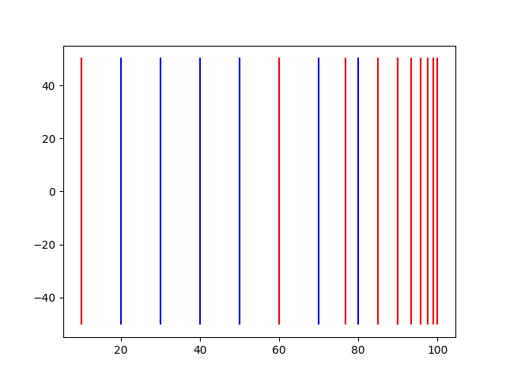

不用的东西学了总是会忘掉。我还是做点笔记吧。
<!-- more -->

# 废话
不得不说，课和课之间的差距真是不比人和人之间的差距小。

# 笔记
本文为学习[Games 101](http://games-cn.org/intro-graphics/)过程中的随手笔记。很多内容之前各个来源了解过但欠缺系统连结和应用，慕名前来重修一遍。也因此笔记略过一些熟悉的内容，课程2倍速播放也记不了太多。

## L2 线性代数回顾
没什么好说的。叉积用得实在不多印象模糊，记一些。

### 向量叉积
#### 定义 & 性质
- 方向：右手定则
- 长度： $|a||b| \sin \theta$
- 交换律：$a \times b = - b \times a$
- 矩阵形式：


$$
a \times b = A^* b =
\begin{pmatrix}
0 & -z & y\\ 
z & 0  & -x\\
-y & x & 0
\end{pmatrix}
$$


#### 应用
- 判断左右，叉积结果为正 *（个人理解为再对$(1, 1, 1)$做一次混合积）* 在左
- 判断点是否在图形内：各边依次叉积，判断是否同左或同右（光栅化基础）

### 基向量
也没什么好说的。但有一个有意思的恒等式：

$$
对于一组标准正交基\vec{i}, \vec{j}, \vec{k} \\
\vec{p} = (\vec{p} \cdot \vec{i})\vec{i} + (\vec{p} \cdot \vec{j})\vec{j} + (\vec{p} \cdot \vec{k})\vec{k}
$$


原理上是显然的：向量分别投影(内积)到各个基向量再乘以该基向量，最后加总组成原向量。但线性代数的证明没有想清楚。但对于任意维度，掰成解析几何用代数方法证明应该也是显然正确的。

## L3 变换
放缩、反射略过，旋转后面说

Shear 切变 一维度不变 另一维度放缩比例与前一维度线性相关。横拉平行四边形。

以上均为线性变换

### 旋转矩阵
#### 定义

$$
\begin{pmatrix}
\cos{\theta} & -\sin{\theta}\\ 
\sin{\theta} & \cos{\theta}
\end{pmatrix}
$$


#### 性质
旋转矩阵$A$，是一个正交矩阵。这意味着$A^T = A^{-1}$。

> ##### 正交矩阵
> 正交矩阵共有两类，旋转是其第一类，行列式为1；另一类行列式为-1。  
> 正交矩阵是各个向量都互相正交，构成一组正交基的矩阵。由此产生的变换可以认为是转换正交基的一类变换。在这类变换中，坐标原点不变，向量长度不变；你也可以说各点之间的欧氏距离不变。
> 
> ##### 正交变换
> 直接正交矩阵直接放向量左乘即可变换到该组正交基。

$$
将任意正交矩阵A表达为
\begin{pmatrix}
\vec{i} \\
\vec{j} \\
\vec{k}
\end{pmatrix}
，则A \vec{x} =
\begin{pmatrix}
\vec{i} \cdot \vec{x} \\
\vec{j} \cdot \vec{x} \\
\vec{k} \cdot \vec{x}
\end{pmatrix}
$$

> 
> 这熟悉的内积投影，同理于之前[基向量一节](#基向量)所提到的公式。

#### 应用
由于正交矩阵的性质，当求旋转矩阵不好求时，可以先求逆矩阵后做转置。

### 齐次坐标 Homogeneous Coordinates
#### 动机
事实上齐次坐标的引入还见过其他更多的解释和优势，比如表示无穷远点，符合透视原则等，但想不全了。这里只介绍了一个主要原因：统一平移变换。

#### 设计
增加一个维度：
- 向量： $(x, y, 0)$
- 点： $(x, y, 1)$

平移表示为

$$
\begin{pmatrix}
0 & 0 & t_x\\ 
0 & 0 & t_y\\
0 & 0 & 1
\end{pmatrix}
\begin{pmatrix}
x\\
y\\
1
\end{pmatrix}
$$


从而有：
- 向量+向量=向量
- 点-点=向量
- 点+向量=点
- 点+点=**中点**

对于点$(x, y, w)$，其与$(x/w, y/w, 1)$表示同一个点。

#### 仿射变换 Affine Transformations
##### 词源
中文似乎是胡逼音译过来的……英文中代表很像，与congruency, similarity成递进关系，转换前后空间中保持平行关系，距离保持比例关系。

##### 定义
线性变换+平移

## L4 三维变换
### 视图/相机变换 View/Camera Transformation
事实上就是求一个ModelView Transformation Matrix。

习惯上把摄像机放在坐标原点，指向-z方向，顶端指向y方向，由此三个约束唯一确定摄像机姿态。同时将世界中的物体依同样变换转移坐标系。

变换组合为$R T$，即先平移到坐标原点，再进行旋转（左乘规则，右侧T先被计算）。平移简单，齐次第四列加上平移差量即可。旋转时先考虑逆变换：目标空间中单位基向量经过怎样的变换$R^T = R^{-1}$到当下空间中的基向量。


$$
Current base:
(\vec{g \times t}, \vec{g}, \vec{t})^T \\

Target \vec{x} = (1, 0, 0)^T, so the first column is (x_{\hat{g} \times \hat{t}}, y_{\hat{g} \times \hat{t}}, z_{\hat{g} \times \hat{t}})^T
$$


然后再求个逆得到

$$
\begin{pmatrix}
x_{\hat{g} \times \hat{t}} & y_{\hat{g} \times \hat{t}} & z_{\hat{g} \times \hat{t}} \\
x_t & y_t & z_t \\
x_{-g} & y_{-g} & z_{-g}
\end{pmatrix}
$$


> 个人理解倒也不必这么麻烦。根据前面[正交变换](#正交变换)这里的理解，要想转换单位正交基到一组新的正交基， 直接左乘一个由新正交基构成行向量的正交矩阵就可以了，这样可以直接得出所需的$R$。

由此，我们得到了MV矩阵。

### 投影变换 Projection Transformation

#### 正交投影 Orthographic Projection
- 简单的理解
  - 摄像机仍然[这么摆放](#视图相机变换-viewcamera-transformation)
  - 丢弃Z轴
  - 平移并缩放到$[-1, 1]^2$平面
- 图形学操作  
  定义标准立方体，将$[l, r] \times [b, t] \times [f, n]$映射到标准(canonical)立方体$[-1, 1]^3$
  - 注意到由于右手坐标系，我们沿-z方向观察，因此远(far)的z值更小，处于闭区间左端  
    > 因此OpenGL等使用左手系，使得far > near更直观
  - 很显然的，我们得到以下变换矩阵(先平移(右侧)，再缩放(左侧))*（不过先缩放好像也未尝不可？平移矩阵变成一个常量）*  
  
  $$
  M_{ortho} =
  \begin{pmatrix}
  \frac{2}{r-l}&0&0&0\\
  0&\frac{2}{t-b}&0&0\\
  0&0&\frac{2}{n-f}&0\\
  0&0&0&1
  \end{pmatrix}
  \begin{pmatrix}
  0&0&0&-\frac{r+l}{2}\\
  0&0&0&-\frac{t+b}{2}\\
  0&0&0&-\frac{n+f}{2}\\
  0&0&0&1
  \end{pmatrix}
  $$
  

#### 透视投影 Perspective Projection
尝试将棱台frustrum *（但愿我没拼错）*通过线性变换挤压成长方体，再应用正交投影。

首先通过切面的相似三角形，可以得到x, y的缩放系数为$n/z$。即任意一齐次坐标$(x, y, z, 1)$应用挤压变换后映射到$(nx, ny, ?, z)$。显然该矩阵有以下形式：


$$
\begin{pmatrix}
n&0&0&0\\
0&n&0&0\\
?&?&?&?\\
0&0&1&0
\end{pmatrix}
$$


注意到以下两种特殊解/约束条件：
- 近平面上所有点映射到自身
- 远平面上所有点映射到相同平面上，且中心点映射到自身

可以得到所要求的变换矩阵为

$$
M_{perspective2ortho} =
\begin{pmatrix}
n&0&0&0\\
0&n&0&0\\
0&0&n+f&-nf\\
0&0&1&0
\end{pmatrix}
$$


则完整变换

$$
M_{projection} = M_{orthographic}M_{perspective2ortho}
$$


#### 思考问题
> 远近平面深度不变，那么之间的点呢？

应该是变远了(更接近远平面)。尝试证明如下：

对于其中任意一点$(x, y, z, 1)$，变换后坐标为$(nx, ny, (n+f)z-nf, z)$，深度值为$n+f-\frac{nf}{z}$。


$$
z - (n+f-\frac{nf}{z}) = z + \frac{nf}{z} - (n+f),\ z \in [f, n] \\
\because z + \frac{nf}{z} \text{is convex with a minimum value}\ 2 \sqrt{nf}, \text{maximum value}\ n+f\\
\therefore z \le n+f-\frac{nf}{z} \ \blacksquare
$$


但我很好奇这到底是怎么样的一个变换，拿Python简单画了个图。[10, 100]，等距蓝色直线经过变换后到红色。还是挺大的一个挤压。



原本想象的是Z不变。尝试写一个期望的Z不变的变换矩阵发现不太行。由于x, y压缩时带入了z变量，导致要保证这矩阵是齐次的话z也要带入一个1/z的系数，从而变换矩阵只能唯一是我们求到的这个。所以约束条件可以多一个：变换矩阵得是齐次的。

## L5 光栅化（三角形） Rasterization (Triangles)
### 视口变换
保持z不变，x,y扩展到视口大小。$[-1,1]^2$到$[0, width] \times [0, height]$。

视口变换矩阵：

$$
M_{viewport} = TS =
\begin{pmatrix}
\frac{width}{2} &0&0&\frac{width}{2}\\
0&\frac{height}{2}&0&\frac{height}{2}\\
0&0&1&0\\
0&0&0&1
\end{pmatrix}
$$


### 三角形
使用三角形作为片元的优点：
- 保证同一平面
- 易插值
- 方便判断内部

### 光栅化
**光栅化本质是使用inside函数（判断点是否在三角形内）在屏幕空间进行采样**。
还是上次说的使用外积判断点是否在内部。

对于每一个图形通过取包围盒减少计算量。简易片元包围盒取三个顶点的$x_{min}, y_{min}, x_{max}, y_{max}$组成矩形四个顶点。

反锯齿（Anti-aliasing）是一个重要问题。

## L6 光栅化（抗锯齿和Z-buffering） Rasterization (Antialiasing and Z-Buffering)
### 抗锯齿
采样是图形学常见(Ubiquitous)概念。同样走样(Aliasing)也是。采样误差被称为*Sampling Artifacts*。
- 锯齿 *(Jaggies)*：空间采样误差
- 摩尔纹 *(Moire)*：图像欠采样
- 电风扇倒转 *(Wagon wheel effect)*：时间采样误差
- ...

原因：**高频信号采样频率不够**

#### 抗锯齿采样
模糊预处理（低通滤波），过滤掉奈奎斯特 *(Nyquist)* 极限以上的信号。

图像高频信息通常表达边界，低频缺少细节。

##### 傅里叶变换

时域的卷积 = 频域的乘积
时域的乘积 = 频域的卷积

采样 = 冲激函数 * 原始函数  
因此在频域上采样 = 冲激函数频率 卷积 原始函数频域  
因此**采样在频域就是重复原始信号频谱**。

##### 抗锯齿方法
- 增加采样率（增大分辨率） 不太行（硬件改动）
- 过滤高频信号 行！

##### MSAA Multi Sampling AA
像素内超采样，取平均值。超采样得到近似三角形覆盖，实现模糊步骤。**成倍增加计算量**。

##### FXAA Fast Approximate AA
找出锯齿边界并替换。

##### TAA Temporal AA
复用上一帧信息。

## L7 着色（光照，着色和渲染管线） Shading (Illumination, Shading and Render Pipelne)
接上节未完成的深度测试。

### 深度测试
#### 画家算法
从远到近覆盖绘制。存在不可解的深度关系，如三个物体互相交错。

#### 深度缓存
正想问MSAA的深度缓存怎么做，没想到是作业。待会儿看一下。猜一下是把深度缓存扩大到超采样点，之后计算覆盖值应该在最后一步。想想都觉得很合理，接近的两个超像素会混合颜色。emm~满意。

透明物体不参与Z-Buffering。

### 着色
#### Blinn-Phong Reflectence
模型定义光照 = 高光 *(Specular)* + 漫反射 *(Diffuse)* + 环境光 *(Ambient)*

着色是局部 *(local)* 的。只考虑本身，不考虑其它元素（阴影）。

有以下4个属性：
- 入光方向$l$
- 法向量$n$
- 视线方向$v$
- 其他属性（shiness, color ,...）

##### 漫反射
1. Lambert cosine law  
能量守恒看，光方向与片元面法向量夹角决定片元收到的能量强度
2. Light falloff  
能量守恒看，点光源辐射能量强度与距离平方反比（类比电磁场/引力）


$$
L_d = k_d \frac{I}{r^2} \max(0, \hat{n} \hat{l})
$$


**漫反射与观察角度无关**。

## L8 着色（着色，管线和纹理映射） Shading (Shading, Pipeline and Texture Mapping)
继续Blinn-Phong模型

### 着色
#### Blinn-Phong Reflectence Cont.
##### 高光
越接近出射光方向越亮。做一个减少计算量的优化：v越接近出射光方向同时也意味着v与l的 ***半程向量*** h越接近法线n。h所需计算量比出射光小。

$$
\vec{h} = \frac{\vec{l} + \vec{v}}{|\vec{l} + \vec{v}|}
$$



$$
L_s = k_s \frac{I}{r^2} \max(0, \hat{n} \hat{h})^p
$$


指数$p$使得cosine函数更陡峭，高光反射范围更窄。***高光一般取白色***。

##### 环境光

$$
L_a = k_a I_a
$$


##### 加总

$$
L = L_a + L_s + L_d
$$


#### 着色频率
- flat shading: 对每个三角形求法线并统一着色
- Gouraud shading: 对顶点着色并插值
- Phong shading: 插值法线向量并对每个像素着色 *（与光照模型不是同一概念）*

当面数增大时，他们之间是一个trade-off。面数超过像素数，或许Phong shading更省资源。

##### 顶点法线
周围面法线（加权）求平均。

##### 像素法线
顶点法线插值。

### 实时渲染管线
- 输入：三维空间顶点
- 顶点处理：投影到屏幕空间
- 三角形处理：形成三角形
- 光栅化：形成离散片元
- 片元(Fragment)处理：着色片元
- 帧缓存操作：输出到屏幕

顶点、片元可编程。除此外出现更多的可编程shader比如geometory（可增加三角形）、computing（通用计算）。

### 纹理映射
几何参数化问题（none of our business）

## L9 着色（纹理映射） Shading (Texture Mapping cont.)
### 纹理映射
#### 重心坐标 Barycentric Coordinates
一种三角形的坐标系统

三角形ABC中，任意点$(x,y)$可以表示为$\alpha A + \beta B + \gamma C$，其中$\alpha + \beta + \gamma = 1$。对于三角形内任一点，三个参数非负。

参数计算可以使用三角形面积比。（叉积）

***重心坐标在投影中并不是不变的***。因此三维空间插值应在三维空间中完成后再投影。

#### 纹理放大 Texture Magnification
- 最近邻
- 双线性插值 Bilinear Interpolation: xy方向最近四个texel简单线性插值
- 双立方插值 Bicubic：最近16个texel线性插值

#### 纹理过大
##### Mipmap
生成分辨率 1/4的多个纹理，额外占1/3空间
- 三线性插值 +层与层之间插值 

##### 各向异性过滤 Anisotropic Filtering
Ripmap解决矩形区域采样问题，但更多异形无法解决（如斜着采样），可借助EWA等花费更多代价解决。

## L10 几何 Geometry (Introduction)
### 纹理映射 cont.
#### 其他应用
- 环境光照 球状贴图 -> cubic map
- 法线贴图: 计算相邻贴图位置高度差，新向量垂直于计算得到的梯度
- 位移贴图 *Displacement mapping*：真实移动顶点，不会在边缘/阴影露馅  
  要求三角形定义比纹理更细。可联合动态细分 *Dynamic tasellation*应用。

### 几何
- 隐式几何：使用点满足的关系表示几何  
  包括解析式、距离函数（可以由离散grid-stored value表示）
- 显示几何：通过直接给出点或使用参数映射 *(parameter mapping)*的方式  
  With a mapping and function $f: \mathbb{R}^2 \rightarrow \mathbb{R}^3; (u,v)\mapsto (x,y,z)$

隐式几何
- 优点：
  - 紧实(compact)的表示
  - 特定查询方便（内部性判断、到表面距离）
  - 易于线面相交计算
  - 简单形体无采样误差
  - 易于处理拓扑变换
- 缺点：
  - 不易描述复杂形体

## L11 几何（曲线和面） Geometry (Curves and Surfaces)
### 显式几何
- 点云
- 多边形 meshes
- 参数映射 贝塞尔曲线

#### 贝塞尔曲线 Bezier Curves
##### 性质
- 端点插值
- Tagent to end segments
- 仿射变换特性：变换后的曲线与仿射变换后的控制点的到的贝塞尔曲线一致
- 曲线在控制点所在的凸包 *(convex hull)* 内

日常应用中常用四个控制点（钢笔工具）多个分段曲线组成长段光滑曲线。对齐连接点控制点共线并等长距离可做到C0光滑（一阶导数一致）

#### 样条 spline
一条穿过各个控制点的曲线

##### B(basis)-splines
- 相比贝塞尔曲线需要更多信息
- 满足所有贝塞尔曲线性质，是其超集
- 局部性

较为复杂，不为展开。另有非均匀有理B样条(NURBS)。同时曲线操作也不为展开。
> 相关展开内容可以参考[Prof. Shi-Min Hu's course](https://www.bilibili.com/video/av66548502)。

#### 贝塞尔曲面
二维下如同双线性插值，一个方向上的控制点定义了一组平行贝塞尔曲线；再对平行贝塞尔曲线在另一个方向上取值认为是一组最终控制点，定义了在另一个方向上连续的一组贝塞尔曲线，从而组成曲面。

*我猜测维度方向的选择应该和最终结果无关。但不是很想证明。本质上贝塞尔曲线是多次线性插值的结果，这个性质应该是符合直觉的。*

#### 面操作
- 面细分 subdivision
- 面简化 simplification
- 面正规化 regularization

## L12 几何 Geometry
首先骄傲了下CG第二次获得图灵奖，并炫耀了一下“科研族谱” *(What's that?!)* 获得图灵奖的是Prof. Yan握过手的师爷 *(还是值得骄傲的恭喜恭喜。这么算我祖师爷拿了图灵奖，与有荣焉🤪)*

### 面细分
#### Loop Subdivision (三角形面)
- 连接三角形各边中点得到细分三角形。
- 新顶点位置 = 3/8 两近顶点位置 + 1/8 两远顶点位置
- 旧顶点位置更新 = (1 - n*u)本顶点原位置 + u邻居顶点位置和，n为顶点的度，u = n==3 ? 3/16 : 3/(8n)

#### Catmull-Clark Subdivision (General Mesh)
不要求全是三角形面。

奇异点(Extrodinary Points)指度不为4的顶点。
对每个非四边形面，取面上中点，连接周围边上中点。其余连接边上中点。经过一次细分后会产生非四边形面数量的奇异点。此后所有面变为四边形面。

面上的点：$f = \frac{v_1+v_2+v_3+v_4}{4}$  
边上的点：$f = \frac{v_1+v_2+f_1+f_2}{4}$  
原先顶点：$v = \frac{f_1+f_2+f_3+f_4+2(m_1+m_2+m_3+m_4)+4p}{16}$

### 面简化
#### Collapsing edges
边坍缩。将一条边去除，连接两端顶点。

##### 误差度量：二次误差
最小化新点到原先各个面的距离平方和。

##### 边选择
对所有边求二次误差最优值，依次选择最小误差边进行坍缩。(Garland & Heckbert 1997)

动态更新局部受坍缩影响的点。堆。

### Shadow Mapping
对点光源而言，不在阴影中的点 = 能被摄像机看到 && 能被点光源看到。（传统阴影映射只能处理点光源）

1. 从光源看向场景，记录深度
2. 从摄像机看向场景，对每个点投影回光源记录的平面，检测光源深度缓存是否与当前深度一致

问题：
- 硬阴影only（点光源）
- 质量依赖shadow map分辨率
- 引入浮点数相等比较带来的精度问题

#### 软阴影
是由于光源存在大小而非点光源引起

## L13 光线追踪 Ray Tracing
### 假设
- 光沿直线传播
- 光不会碰撞
- 光从光源到眼睛（但光路是可逆的 *(reciprocity)* ）

### Whitted-Style Ray Tracing
从视点发射光线，递归。每次碰撞判断交点与光源可见性，求着色。

#### Ray-Surface Intersection
##### Ray Equation

$$
r(t) = o + t\vec{d}, 0 \le t \le \inf
$$


##### 隐式表示求交
代入函数求解。发达的数值方法不用担心求不出来。

##### 显示表示求交 （三角形面）
对每个三角形求交？（加速方法卖个关子[之后再讲](#求交加速)）
###### 求交方法
分解成两步
1. 与三角形所在平面求交点
2. 判断交点是否在三角形内

平面法线$N$，任意一点$p^{\prime}$，平面点法式$(p-p^{\prime})\cdot N = 0$。带入射线方程解得


$$
t = \frac{(p^{\prime} - o) \cdot N}{d \cdot N},\ t \in [0, \inf)
$$


###### Molller Trumbore Algorithm
更快的方法。利用重心坐标解以下线性方程组：


$$
O+tD = (1-b_1-b_2)P_0+b_1 P_1 + b_2 P_2
$$


得到重心坐标后可以立刻判断是否在三角形内。

##### 求交加速
###### 包围体积 Bounding Volumn
三维长方体包围盒：认为由三对平行平面(pairs of slabs)组成的交集（轴对齐包围盒(*Axis-Aligned Bounding Box (AABB)*)）

对每一组对面都求一个进入时间和离开时间。光线在盒子内的时间为$[\max(t_{enter}), \min(t_{exit})]$。

有以下特殊情况需要处理：
- $t_{exit} \lt 0$：盒子在后面，无交点
- $t_{exit} \ge 0, t_{enter} \lt 0$：在盒子内

当且仅当$t_{enter} \lt t_{exit}, t_{exit} \ge 0$时有交点。

*平行于轴的光线怎么办？*

## L14 光线追踪 Ray Tracing
##### 求交加速 cont.
###### 网格法 Uniform Grids
将场景划分为网格组成包围盒指示内部是否存在物体边界。

###### 空间划分 Spatial Partition
- 八叉树 Oct-Tree
- KD-Tree
- BSP-Tree

KD-Tree is preferred. 但由于多边形求交困难，渐渐不用。一个物体同时可能存在多个盒子内。

##### 物体划分 Object Partition & Bounding Volume Hierarchy (BVH)
将集合中物体分成两份（按空间划分）各自计算包围盒。启发式延长轴划分。启发式按中间位置物体划分。寻找中位数是一个O(n)算法。*改一改快排就行了。*

###### 伪代码
```c
void intersect(Ray ray, BVH node) {
    if (ray misses node.bbox) return;
    if (node is a leaf node) {
        test all objs;
        return closest intersection;
    }

    hit1 = intersect(ray, node.child1);
    hit2 = intersect(ray, node.child2);
    reuturn closer of hit1, hit2;
}
```

### 辐射度量学 Basic Radiometry
*学物理可太快乐了*

#### 光的空间属性
- radiant flux 辐射通量
- intensity 辐射强度
- irradiance
- radiance

##### Radiant Energy and Flux (Power)
- energe Q in J(oule)
- flux (power) $\Phi \equiv \frac{dQ}{dt}$ in W(att) / lm (lumen)

##### Important Light Measurements of Interest
- light emitted from a source: radiant intesity
- light falling on a surface: irradiance
- light traveling along a ray: radiance

##### Radiant Intensity
power per unit **solid angle**(立体角): $I(\omega) \equiv \frac{d \Phi}{d \omega}$ in **c**an**d**ela, W or lm divided by solid angle.

*坎德拉是基本单位之一，代表光亮度，光亮度与能量不是同一概念。可能是借用？*

###### Solid Angle
立体角度对应球面面积除以半径平方. 球面立体角4pi.


$$
dA = (rd \theta)(r \sin \theta d \phi) = r^2 \sin \theta d \theta d \phi \\
d \omega = \frac{dA}{r^2} = \sin \theta d \theta d \phi
$$


$\theta$作为纵向角，$\phi$作为横向角，两者定义方向向量$\omega$。

###### 各向同性点光源 Isotroppic Point Source

$$
\Phi = \int_{S^2} Id \omega = 4\pi I \\
I = \frac{\Phi}{4\pi}
$$


## L15 光线追踪 Ray Tracing

##### Irradiance
Power per unit area. 光线垂直打到表面上。


$$
E(x) = \frac{d\Phi(x)}{dA}
$$

单位lux(lm/m^2)

##### Radiance
Power emitted/reflected/transmitted/received by a surface, per unit solid angle, per projected unit area. 理解为单位面积朝单位立体角辐射/被辐射的能量（*此处指功率，下同*）


$$
L(p, \omega) \equiv \frac{d^2\Phi(p, \omega)}{d\omega dA\cos\theta}
$$


单位nit(cd/m^2)

#### Bidirectional Reflectance Distribution Function (BRDF)
表示从每个入射角反射到每个出射角的光线量


$$
f_r(\omega_i \rightarrow \omega_r) = \frac{dL_r(\omega_r)}{dE_i(\omega_i)} = \frac{dL_r(\omega_r)}{L_i(\omega_i)\cos\theta_id\omega_i}
$$


单位1/sr。*个人理解可以理解为对于一个出射方向能量，各个入射方向的贡献分布。*

#### 反射方程 Reflection Equation
对于特定观察方向（出射角），辐射光量为


$$
L_r(p, \omega_r) = \int_{H^2}f_r(p, \omega_i\rightarrow\omega_r)L_i(p, \omega_i)\cos\theta_id\omega_i
$$


这个方程是递归求解的。麻烦。

#### 渲染方程 Rendering Equation
增加一个发射光量。得到


$$
L_o(p, \omega_r) = L_e(p, \omega_o) + \int_{\Omega^+}L_i(p, \omega_i)f_r(p, \omega_i, \omega_o)(n\cdot\omega_i)d\omega_i
$$


即渲染方程。

已知发射intensity，BRDF，入射角度，可以将式子简写为


$$
\begin{aligned}
I(u) &= e(u) + \int I(v)K(u,v)dv \\
\implies L &= E + KL
\end{aligned}
$$


其中K为equation kernel，Light Transport Operator。这是一个经典形式的第二类Fredholm积分方程：有良好的数值解。

*艹，接下来开始不明所以但很有道理的……泛函分析？PDE？还是基于什么别的东西的推导。函数当矩阵算好爽啊。以及一个二项展开。这级数收敛性……据说是收敛的。*


$$
\begin{aligned}
L&=E+KL\\
IL-KL&=E\\
(I-K)L&=E\\
L&=(I-K)^{-1}E\\
L&=(I+K+K^2+K^3+\ldots)E\\
L&=E+KE+K^2E+K^3E+\ldots
\end{aligned}
$$


我们得到了一个级数。第一项为光源直射，第二项为直接光照，第三项为弹射一次的间接光照，之后为更多次的间接光照。**作为经典光栅化着色，我们得到的是光源直射和直接光照的近似**（近似到前两项）。

##### 概率论回顾
*概率论还没忘那么多，不多回顾了*


$$
X \sim p(x)\\
Y = f(X) \\
E[Y] = E[f(X)] = \int f(x)p(x)dx
$$


## L16 光线追踪（蒙特卡洛路径追踪） Ray Tracing (Monte Carlo Path Tracing)
### 蒙特卡洛积分 MC
对$\int f(x)dx$的求解可以通过抽样近似。设抽样随机变量$X \sim p(x)$，则


$$
\int f(x)dx \approx \frac{1}{N}\sum^N_{i=1}\frac{f(x_i)}{p(x_i)}
$$


### 路径追踪 Path Tracing
从而我们可以通过MC解渲染方程。对于表面以上各方向入射光线积分，每次随机选择n个方向求均值。理论完备，但实现中有以下问题：
- MC采样数指数上升
- 递归求解没有递归终点
- 采样数减少导致结果噪点较大

#### 路径追踪优化
对于采样数指数上升问题，将采样数限定为1可避免增长。进行多次Tracing求均值。

递归终点若简单限制步长会造成能量损失。通过“俄罗斯轮盘赌”方法每次以一定概率结束采样，同时对接受的采样除以概率p，可使得最终能量的期望仍守恒。

在有限的采样数内，若使用均匀采样会有较多的结果miss直接光照，样本无效率较高。提高采样效率，通过选取另一种MC采样分布实现。  
采样分为光源采样及间接光照采样。光源通过将积分微元从$dw_i$转换到$dA$，即选取有效物体表面进行采样，规避无效采样。微元间有以下关系（$dA$乘以$\cos\theta^\prime$得到平行于反射面面积，剩余部分相似三角形易证）


$$
dw_i = \frac{dA\cos\theta^\prime}{\|x-x^\prime\|^2}
$$


其中$\theta^\prime$为入射光线（光源的出射光线）相对于光源平面法线的角度。  
间接光照维持球面随机采样，轮盘赌结束递归的方式。  
采样微元转换到光源平面后，需要解决光源是否被遮挡问题。从着色点cast ray到光源微元点，看是否被遮挡。

路径追踪结束。

路径追踪处理点光源上有点麻烦。*大概是点光源没有面积的原因，采样受到了干扰。这是点光源的问题🐶* 考虑做成小面积光源。

##### 路径追踪的一些Topic
- 重要性采样：MC采样分布的优化
- 多重重要性采样：结合半球采样与光源采样
- 像素重建滤镜：像素radiance不必是所有穿过它的路径的均值
- 伽马矫正/色彩空间：像素的radiance不必是像素的颜色
- 抽样方法的选择
- 随机数的选择：low discrepancy sequences
- 除路径追踪外的其他方法：
  - 光子映射 photon mapping
  - 双向路径追踪
  - Metropolis light transport
  - VCM / UPBP
  - ...

*他保证难的都过去了。这个梯度可真好。可能老师期望不是很高吧hhhh*

## L17 材质与外观 Materials and Appearances
Material = BRDF

### 漫反射材质 Diffuse/Lambertian Material
假设入射光线是均匀的，在各个方向上都是常数   
*这个假设其实没有很确信起因。模型上来讲只能说因为漫反射出射光与入射光无关，因此做这么个假设简化计算。但如此BRDF分布就被大大简化了……不过确实变得可解了。*
*本来一直好奇BRDF这么个复杂的二维概率分布该怎么实现，所以BRDF最后还是会退化么。*

$$
\begin{aligned}
L_o(\omega_o) &= \int_{H^2}f_rL_i(\omega_i)\cos\theta_id\omega_i \\
&= f_rL_i\int_{H^2}\cos\theta_id\omega_i \\
&= \pi f_rL_i
\end{aligned}
$$


可知$f_r = \frac{1}{\pi}$时能量守恒，完全反射入射光。定义$f_r = \frac{\rho}{\pi}$，$\rho$为反射率（albedo(color)），在0到1之间。

### 完全镜面反射 Perfect Specular Reflection
平行四边形法则得出射角，方位角180度。

### 折射 Refraction
#### 斯涅耳定律
$\eta_i\sin\theta_i = \eta_t\sin\theta_t$

$$
\begin{aligned}
\eta_i\sin\theta_i &= \eta_t\sin\theta_t \\
\cos\theta_t &= \sqrt{1 - \sin^2\theta_t} \\
&= \sqrt{1-(\frac{\eta_i}{\eta_t})^2\sin^2\theta_i} \\
&= \sqrt{1-(\frac{\eta_i}{\eta_t})^2(1 - \cos^2\theta_i)} \\ \\
1-(\frac{\eta_i}{\eta_t})^2(1 - \cos^2\theta_i) \ge 0
\end{aligned}
$$


### 菲涅尔项 Fresnel Term
反射性和法线夹角、光线极化有关。法线夹角越大，反射性越强，反射能量越多。（玻璃越斜看越不透明）

导体绝缘体菲涅尔项不同。


$$
R_s = \left|\frac{n_1\cos\theta_i-n_2\cos\theta_t}{n_1\cos\theta_i+n_2\cos\theta_t}\right|^2 \\
R_p = \left|\frac{n_1\cos\theta_t-n_2\cos\theta_i}{n_1\cos\theta_t+n_2\cos\theta_i}\right|^2 \\
R_{eff} = \frac{R_s+R_p}{2}
$$


#### Schlick's approximation

$$
R(\theta) = R_0 + (1-R_0)(1-\cos\theta)^5 \\
R_0 = (\frac{n_1-n_2}{n_1+n_2})^2
$$


### 微表面模型 Microfacet Material
近处是几何，远处是材质。使用微表面材质得法线分布来定义材质。glossy法线分布相对集中，diffuse法线分布相对分散。


$$
f(i,o) = \frac{F(i,h)G(i,o,h)D(h)}{4(n,i)(n,o)}
$$

F为菲涅尔项，G为自阴影项（shadowing-masking term），D为法线分布。平射光线(掠射角度Grazing Angle)更容易被自阴影挡住。

### 各向同性/异性材质 Isotropic/Anisotropic Materials (BRDFs)
*没说怎么模拟解决，只提了几个case。*

### BRDF的若干性质
- 非负性
- 线性：指线性可加，可分为不同部分分别计算后相加（Blinn-Phong的正确性来源）
- 可逆性：交换入射出射方向，数值完全一致
- 能量守恒：BRDF给定出射角，对所有入射角积分，值小于等于1：保证了光追收敛
- 各向同性与各项异性
  - 各向同性中$f_r(\theta_i,\phi_i;\theta_r,\phi_r) = f_r(\theta_i,\theta_r,\phi_r-\phi_i)$，四维降为三维函数
  - 由可逆性可知  
    $f_r(\theta_i,\theta_r,\phi_r-\phi_i)=f_r(\theta_r,\theta_i,\phi_i-\phi_r)=f_r(\theta_i,\theta_r,|\phi_r-\phi_i|)$

### 测量BRDF
- Image-based: Gonioreflectometer / spherical gantry
- 材质存储：耗空间大。MERF BRDF Database可供参考。存储压缩是一个时兴话题。

## L18 高阶渲染话题 Advanced Topics in Rendering
### 高级光线传播 Advanced Light Transport
- 无偏光线传播方式 Unbiased light transport methods
  - Bidirectional path tracing (BDPT)
  - Metropilis light transport (MLT) *named after inventor*
- 有偏光线传播 Biased light transport methods
  - Photon mapping 光子映射
  - Vertex connection and merging (VCM) 光子映射+双向路径追踪
- Instant radiosity 实时辐射度 (VPL/ many light methods)

#### Biased vs. Unbiased Monte Carlo Estimators
- 无偏(Unbiased)估计期望值始终等于真实值，无系统性误差
- 否则有偏(Biased)
  - 当期望值随样本数增多收敛到真实值，则它是一致的(Consistent)

#### 双向路径追踪 (BDPT)
从光源与摄像机分别进行子路径追踪。

- 如果在光源处光线路径复杂，则效果较好
- 难以实现，速度慢

#### Metropolis Light Transport
- 使用马尔科夫链(MCMC)进行采样
  - 以一定概率分布从当前采样点寻找到下一个采样点
- 擅长局部探索一些困难的光路
- 关键思想
  - 局部扰动一条现存的路径以获得新的路径
- 优点
  - 适合解决复杂光路 (e.g. caustics)
  - 无偏
- 缺点
  - 难以估计收敛率
  - 不保证每个像素有相同的收敛率
  - 常常产生“脏的”结果
  - 不常被使用于动画渲染

#### Photon Mapping 光子映射
- 有偏方法 & 两步方法
- 非常善于处理Specular-Diffuse-Specular(SDS)路径并产生焦散(caustics)

大致框架：
1. 光子追踪 photon tracing  
从光源发射光子，弹射，记录光子最后落在的diffuse表面
2. 光子收集 photon collection  
从摄像机发射子路径，弹射，直到击中diffuse表面
3. 计算局部密度估计 (local density estimation)  
  - 思想：拥有越多光子的区域越亮
  - 对每个着色点，寻找最近N个光子，取其覆盖面积，计算密度
    - 如：最近着色点取包围球，求球体在着色面上的相交面积

##### 有偏的原因
局部密度估计中$dN/dA \neq \Delta N/\Delta A$

当光子无限多时，以上估计收敛到真实值。因此本方法一致(Consitent)。

渲染中一般来说
- 有偏方法产生模糊的结果
- 一致方法在样本数无穷大时变得清晰

当使用固定大小区域估计光子密度时，由于$dA$永远不会变小，因此将永远是一个有偏估计，并且不一致。

#### VCM
结合双向路径追踪和光子映射
- 关键思想
  - 不浪费双向光追中的子路径当追踪终点无法被连接但可以被融合时（指在一个面上邻近）
  - 使用光子映射来融合邻近光子

电影行业运用广泛

#### Instant Radiosity
- 有时被称为many-light方法
- 关键思想
  - 被照亮的表面可以被认为是光源
- 方法
  - 发射子光路并认为每条光路的终点都是一个虚拟点光源 （Virtual Point Light）
  - 使用虚拟点光源渲染场景
- 优点
  - 速度快，在漫反射表面有不错的效果
- 缺点
  - 当虚拟点光源接近着色点时会有spikes（异常发光）出现
    - 类比直接光源采样，对立体角的采样转化为对光源面积采样除以距离。当距离平方项极小，结果被异常放大。
  - 无法处理光滑(glossy)物体

### 高阶外观建模 Advanced Appearance Modeling
- 非表面模型 Non-surface models
  - 散射介质 Participating media
  - 毛发纤维 (BCSDF)
  - 颗粒材质 Granular material
- 表面模型 Surface models
  - 半透明材质 Translucent material (BSSRDF)
  - 布料 Cloth
  - 细节材质 Detailed material (non-statistical BRDF)
- 生成外观 (Procedral appearance)

#### 散射介质
- 光线穿过散射介质中的任何时候，它都会（部分）被吸收和散射
- 使用相位函数（Phase Function) 来描述在散射介质中任意点光线在各个角度上的散射分布

##### 散射介质渲染方法
- 随机选择弹射方向
- 随机选择直射距离
- 在每一个着色点，连接光源

#### 毛发
有两种高光
##### Kajiya-Kay 模型
考虑了圆柱体近似下一定角度的散射+漫反射
##### Marschner 模型
将光线分为三部分
- 圆柱体直接反射R
- 穿入头发再穿出TT
- 穿入头发，内部反射后再返回穿出TRT

头发建模为玻璃样圆柱，外层cuticle，内层cortex。

结果真实。多次反射效果很好。计算量大。

##### 双圆柱模型 Double Cylinder Model (Yan model)
听闫老师讲自己的work。*（其实对我感觉人毛发模型用动物上去还是蛮可以接受的了，就是那示例狼脑袋黑了点）*

新增一个毛发髓质(Medulla)的研究。髓质散射光线。动物毛发相比人有更大的髓质。

相比M模型，新增两个光线分类：原先穿过头发的两类光线受髓质影响新增TRTs & TTs。

猩球崛起和狮子王都有采用该毛发模型。均获得奥斯卡最佳视觉效果提名。

#### 颗粒模型
分颗粒成分比例进行渲染。没有得到很好的解决。

#### 表面模型 半透明材质
E.g. 玉石、水母。

##### 次表面反射 Subsurface Scattering

###### Scattering Functions
BSSRDF: BRDF的延申；一点出射光线受另一点入射光线影响$S(x_i, \omega_i, x_o, \omega_o)$

渲染方程的泛化：对表面的所有点和所有方向积分

$$
L(x_o, \omega_o) = \int_A\int_{H^2}S(x_i,\omega_i,x_o,\omega_o)L_i(x_i,\omega_i)\cos\theta_id\omega_idA
$$


##### Dipole Approximation
近似方法：通过引入两个点光源来近似次表面反射。

适合皮肤渲染。

#### 布料
- 缠绕纤维的集合
- 两级缠绕
  - 纤维(Fiber)缠绕成股(Ply)
  - 股缠绕成线(Yarn)
- 线被纺(Woven)或织(Knitted)成不同布料。
- 给定纺织pattern，计算整体behavior

##### 使用BRDF渲染
基本操作。但天鹅绒布料不是一个表面，不太合适。

##### 布料：作为散射介质渲染
- 单独纤维的性质与分布转换为散射参数
- 当作散射介质渲染

##### 布料：作为实际纤维渲染
如同毛发渲染。很好的效果，很大的计算量。

#### 复杂外观
- 动机：渲染过于完美

*闫：博士几年做了一点微小的贡献，大概是三件事：细节渲染是一个，毛发模型是一个，实时光追是一个*

主要展示了下效果。原理听着大概是对于微表面模型的法线分布做了改进，取法线贴图一个周围区域内计算法线pdf，以避免朴素光追在微表面很难追踪到反射到光源的光路的尴尬。

##### 近来潮流：波动光学
将光学卷到波动光学去。考虑光的干涉。涉及到复数域积分，跳过了实现未谈。效果确实很惊叹。例如磨砂铝表面放大看并不是纯白光，而是包含各种颜色杂光，但整体呈现白色。

#### 程序化生成外观 Procedural Appearance
通过噪声函数实时生成纹理。